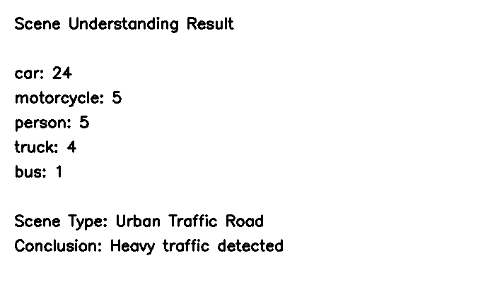

# Smart Traffic Scene Analysis using Computer Vision

## 📌 Project Overview
This project implements a smart traffic analysis system using Computer Vision and Deep Learning. 
It detects vehicles and pedestrians from traffic images and analyzes the detected objects to 
understand traffic conditions such as congestion levels and scene context.


---

## 🎯 Objectives
- To detect multiple objects from a given image
- To recognize and classify detected objects
- To analyze object distribution and infer scene context
- To provide a meaningful conclusion about the environment

---

## 🧠 Key Concepts Used
- Computer Vision
- Object Detection
- Visual Recognition
- Scene Understanding
- Deep Learning
- Convolutional Neural Networks (CNN)

---

## 🏗️ Project Architecture
The system follows a sequential processing pipeline:

1. **Image Input**
   - Input image is loaded from the dataset

2. **Computer Vision Preprocessing**
   - Image resizing
   - Color space conversion
   - Visualization using OpenCV

3. **Object Detection**
   - YOLO model detects objects
   - Bounding boxes and confidence scores are generated

4. **Visual Recognition**
   - Detected objects are classified and counted

5. **Scene Understanding**
   - Rule-based logic analyzes object counts
   - Scene type and conclusion are inferred

---

## 📂 Project Structure
Visual-Recognition-Scene-Understanding/
│
├── dataset/
│ └── images/
│ └── test.jpg
│
├── cv_test.py
├── object_detection.py
├── scene_understanding.py
├── requirements.txt
└── README.md

---

## 🛠️ Technologies Used

| Category | Tools |
|--------|------|
| Programming Language | Python |
| Computer Vision | OpenCV |
| Deep Learning | PyTorch |
| Object Detection | YOLO (Ultralytics) |
| Data Processing | NumPy |
| Visualization | OpenCV |

## 📦 Installation & Setup

### 1️⃣ Clone the Repository
```bash
git clone https://github.com/your-username/Visual-Recognition-Scene-Understanding.git
cd Visual-Recognition-Scene-Understanding

### 2️⃣ Create Virtual Environment
python -m venv venv

Activate it:
Windows
venv\Scripts\activate

### 3️⃣ Install Dependencies
pip install -r requirements.txt

▶️ How to Run the Project
Step 1: Computer Vision Test
python cv_test.py
✔ Displays original and grayscale images

Step 2: Object Detection
python object_detection.py
✔ Displays bounding boxes with object labels and confidence scores

Step 3: Scene Understanding
python scene_understanding.py
✔ Prints detected objects, scene type, and final conclusion in terminal

📊 Sample Output
Object Detection Output

* Cars, buses, trucks, motorcycles, and people are detected

* Bounding boxes drawn with confidence scores

Scene Understanding Output
Objects Detected:
car: 24
motorcycle: 5
person: 5
truck: 4
bus: 1

Scene Type: Urban Traffic Road
Conclusion: Heavy traffic detected

## 🖼️ Output Screenshots

### Object Detection Result


### Scene Understanding Result

